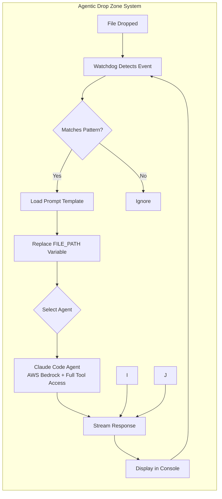

# Agentic Drop Zone

Automated file processing system that monitors directories and triggers AI agents when files are dropped. Built with Claude Code SDK, AWS Bedrock, and Google Cloud integration.

## Features

- 📝 **Single-file Python script** with `uv` dependency management
- ⚙️ **Configurable drop zones** via `drops.yaml`
- 🤖 **Claude Code SDK** with AWS Bedrock integration
- 🎨 **Google Cloud Vertex AI** for parallel image generation
- 🚀 **5 pre-built workflows**: Echo, Images, Training Data, Audio Transcription, Finance
- 📊 **Real-time streaming** with Rich console output
- ⚡ **Tool access** with `bypassPermissions` for autonomous agent actions

## System Architecture




## How It Works

1. **Watch** - Monitors configured directories for file events (create/modify/delete/move)
2. **Match** - Checks if dropped files match configured patterns (*.txt, *.json, etc.)
3. **Process** - Executes Claude Code with custom prompts to process the files
4. **Output** - Rich console display with streaming responses in styled panels

## Quick Start

```bash
# Install uv (if not already installed)
curl -LsSf https://astral.sh/uv/install.sh | sh

# Setup environment variables for AWS Bedrock (recommended)
export CLAUDE_CODE_USE_BEDROCK=1
export AWS_BEARER_TOKEN_BEDROCK="your-api-key"
export AWS_REGION="your-aws-region"
export CLAUDE_CODE_PATH="claude" # default to claude, may need to run which claude to find the path

# OR for direct Anthropic API:
# export ANTHROPIC_API_KEY="your-claude-api-key"

# Run with uv
uv run sfs_agentic_drop_zone.py

# Drag and drop (copy to reuse) files from example_input_files folder into the drop zone directories
cp example_input_files/echo.txt agentic_drop_zone/echo_zone/
```

## MCP Support

- Claude Code supports MCP servers, run `cp .mcp.json.sample .mcp.json` and edit the file with your API keys
- MCP servers can be configured via `mcp_server_file` in drop zone configuration

## ⚠️ Dangerous Agent Execution

**IMPORTANT:** Agents are given complete control over your system with dangerous execution capabilities. Agent permissions are as follows:

- Claude Code runs with `bypassPermissions` mode, which allows all tools without prompting
- Gemini CLI runs with `yolo` flag with the `--sandbox` flag, which auto-approves all actions but prevents moving outside of the sandbox directory
- Codex CLI (not implemented)

**By using this system, you acknowledge the risks and take full responsibility for any actions performed by the agents.**

## Configuration (drops.yaml)

```yaml
drop_zones:
  - name: "Image Generation Drop Zone"
    file_patterns: ["*.txt", "*.md"]           # File types to watch
    reusable_prompt: ".claude/commands/create_image.md"  # Prompt template
    zone_dirs: ["generate_images_zone"]        # Directories to monitor
    events: ["created"]                        # Trigger on file creation
    agent: "claude_code"                       # Agent type
    model: "sonnet"                           # Claude model
    mcp_server_file: ".mcp.json"              # MCP tools config (optional)
    create_zone_dir_if_not_exists: true       # Auto-create directories
```

## Agents

The system supports multiple AI agents with different capabilities:

### Claude Code (Most Capable)
- 
- **Status**: ✅ Fully implemented
- **SDK**: Native Python, Typescript, and CLI SDK with streaming support
- **Output**: Clean, formatted panels with real-time streaming
- **Models**: `sonnet`, `opus`, `haiku`
- **MCP Support**: Full MCP tool integration
- **Best For**: Complex tasks requiring tool use, SOTA performance
- [Documentation](https://docs.anthropic.com/en/docs/claude-code/sdk/sdk-overview)

### Agent Implementation
- **Primary Agent**: Claude Code via AWS Bedrock
- **Tool Access**: Full system access with `bypassPermissions` mode
- **Processing**: Real-time streaming with Rich console output
- **Authentication**: AWS credentials (`~/.aws/credentials`)

### Configuration Example
See `drops.yaml` for agent setup:

```yaml
- name: "Claude Zone"
  agent: "claude_code"
  model: "sonnet"
  mcp_server_file: ".mcp.json" # specify this or it won't use MCP tools

- name: "Gemini Zone"  
  agent: "gemini_cli"
  model: "gemini-2.5-pro"
```

## Claude Code SDK Integration

Uses `ClaudeSDKClient` with streaming responses:

```python
async with ClaudeSDKClient(options=ClaudeCodeOptions(
    permission_mode="bypassPermissions",
    model="sonnet",
    mcp_servers=".mcp.json"  # Optional MCP tools
)) as client:
    await client.query(prompt)
    async for message in client.receive_response():
        # Stream responses in Rich panels
```

## Agentic Workflows

The system comes with several pre-configured workflows. Each requires specific setup and environment variables:

### 🎨 Image Generation Drop Zone
**Directory:** `generate_images_zone/`  
**File Types:** `*.txt`, `*.md`  
**Purpose:** Generate images from text prompts using Replicate AI models

**Requirements:**
- Environment variable: `REPLICATE_API_TOKEN` (required)
- MCP server configuration: `.mcp.json` (copy from `.mcp.json.sample`)
- Claude Code with Replicate MCP tools

**Usage:** Drop a text file containing image prompts. The system will:
- Read each prompt from the file
- Generate images using Replicate's models (default: google/nano-banana)
- Save images with descriptive names and metadata
- Archive the original prompt file
- Open the output directory automatically

### 🖼️ Image Edit Drop Zone  
**Directory:** `edit_images_zone/`  
**File Types:** `*.txt`, `*.md`, `*.json`  
**Purpose:** Edit existing images using AI models

**Requirements:**
- Environment variable: `REPLICATE_API_TOKEN` (required)
- MCP server configuration: `.mcp.json`
- Image URLs or paths in the dropped files

**Usage:** Drop files containing image paths/URLs and editing instructions.

### 📊 Training Data Generation Zone
**Directory:** `training_data_zone/`  
**File Types:** `*.csv`, `*.jsonl` (JSON Lines format)  
**Purpose:** Analyze data patterns and generate synthetic training data

**Requirements:**
- No external API keys required
- Uses Claude Code's built-in analysis capabilities

**Usage:** Drop data files to:
- Analyze a sample (100 rows) to understand patterns
- Generate 25 additional rows (configurable)
- Append new data using efficient bash commands
- Create extended datasets without loading into memory
- Preserve all original data unchanged

**Optimization:** Uses bash append operations to handle large files efficiently

### 🎙️ Morning Debrief Zone
**Directory:** `morning_debrief_zone/`  
**File Types:** `*.mp3`, `*.wav`, `*.m4a`, `*.flac`, `*.ogg`, `*.aac`, `*.mp4`  
**Purpose:** Transcribe morning debrief audio recordings and analyze content for engineering ideas and priorities

**Requirements:**
- OpenAI Whisper installed: `uv tool install openai-whisper`
- No API keys required (runs locally)

**Usage:** Drop audio files to:
- Transcribe using Whisper's tiny model (fast, English)
- Extract top 3 priorities from discussions
- Identify key engineering ideas
- Generate novel extensions and leading questions
- Create structured debrief documents with:
  - Date and quarter tracking
  - Formatted transcript with bulleted sentences
  - Direct commands extracted from transcript
- Archive original audio files after processing

**Output:** Generates markdown debrief files with comprehensive analysis in `morning_debrief_zone/debrief_output/<date_time>/`

## File Structure

```
agentic-drop-zones/
├── sfs_agentic_drop_zone.py     # Main application
├── drops.yaml                   # Configuration
├── tools/                       # External tools and scripts
│   └── vertex_ai_image_generator.py # Google Cloud image generation tool
├── .claude/commands/            # Prompt templates (5 active workflows)
├── agentic_drop_zone/           # Drop directories (auto-created)
├── example_input_files/         # Sample files for testing
├── docs/                        # All documentation
│   ├── CLAUDE.md               # Instructions for future Claude instances
│   ├── agentic_drop_zone_flow_diagram.md  # System flow diagrams
│   └── *.md                    # Technical docs and references
├── .env.sample                  # Environment configuration template
└── README.md                   # This file
```

## Quick Start

1. **Setup Environment:**
   ```bash
   cp .env.sample .env
   # Edit .env with your AWS/Google Cloud credentials
   ```

2. **Run the System:**
   ```bash
   uv run sfs_agentic_drop_zone.py
   ```

3. **Test Workflows:**
   ```bash
   # Test echo
   cp example_input_files/echo.txt agentic_drop_zone/echo_zone/

   # Test image generation
   cp example_input_files/cats.txt agentic_drop_zone/generate_images_zone/
   ```

For detailed setup and usage instructions, see `docs/CLAUDE.md`.

## Monitoring & Logging

The system includes comprehensive logging and monitoring capabilities:

### 📊 System Status & Health Checks
- **Health endpoint**: `curl http://localhost:8080/health`
- **Detailed status**: `curl http://localhost:8080/health/detailed`
- **Active workflows**: `curl http://localhost:8080/workflows/active`
- **Recent workflows**: `curl http://localhost:8080/workflows/recent`

### 📝 Log Files & States
- **Main logs**: `logs/agentic_drop_zone.log` - Application events (INFO+)
- **Error logs**: `logs/errors.log` - Errors and critical issues (ERROR+)
- **Workflow logs**: `logs/workflows.log` - Detailed workflow processing (DEBUG+)

### 🔔 Real-time Notifications
Configure webhook notifications for errors:
```bash
# .env file
NOTIFICATION_WEBHOOK_URL=https://hooks.slack.com/services/YOUR/WEBHOOK/URL
NOTIFICATION_MIN_LEVEL=error
```

### 📈 Workflow States
- `PENDING` - Queued for processing
- `RUNNING` - Currently being processed
- `COMPLETED` - Successfully finished
- `FAILED` - Error occurred during processing
- `TIMEOUT` - Exceeded maximum execution time (5 min default)

**Full documentation**: See `docs/enhanced_logging_and_monitoring.md` for complete logging, error handling, and monitoring setup.

## Improvements

- The `zone_dirs` should be a single directory (`zone_dir`), and this should be passed into each prompt as a prompt variable (## Variables) and used to create the output directory. Right now it's static in the respective prompts.
- Add more workflow templates for different use cases
- Implement MCP server integration for extended tool capabilities

## Master AI Coding 

Learn to code with AI with foundational [Principles of AI Coding](https://agenticengineer.com/principled-ai-coding?y=adrzone)

Follow the [IndyDevDan youtube channel](https://www.youtube.com/@indydevdan) for more Agentic Coding tips and tricks.