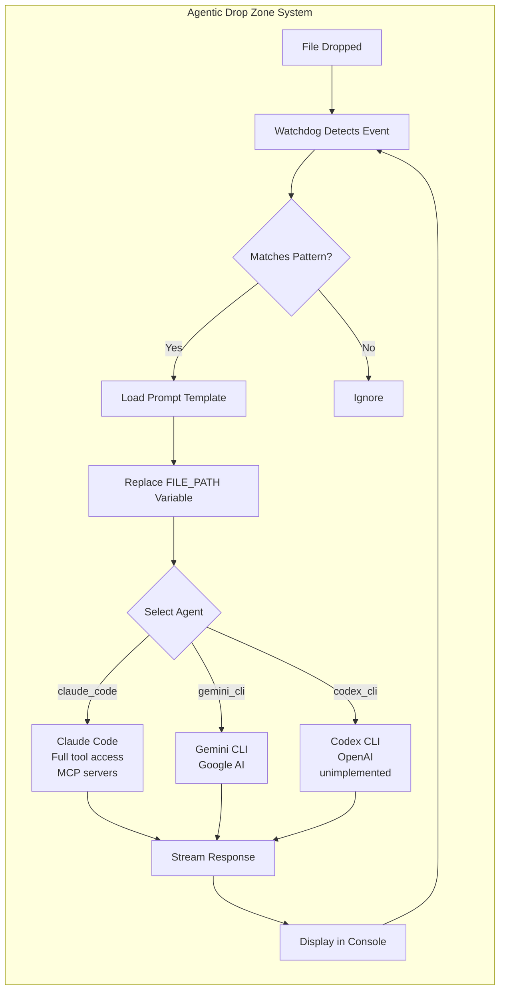

# Agentic Drop Zone
> See what you can do with the Agentic Drop Zone [in this video](https://youtu.be/gyjoXC8lzIw).

Automated file processing system that monitors directories and triggers agents (Claude Code, Gemini CLI, Codex CLI) when files are dropped.

## Features

- 📝 Simple single file script: `sfs_agentic_drop_zone.py`
- ⚙️ Configurable drop zones in `drops.yaml`
- 🤖 Agent agnostic implementation: Claude Code, Gemini CLI, Codex CLI (unimplemented)
- 🧩 Run multiple agents in parallel
- 🚀 Run arbitrary agentic workflows: Do 'anything' your agent can do


## System Architecture




## How It Works

1. **Watch** - Monitors configured directories for file events (create/modify/delete/move)
2. **Match** - Checks if dropped files match configured patterns (*.txt, *.json, etc.)
3. **Process** - Executes Claude Code with custom prompts to process the files
4. **Output** - Rich console display with streaming responses in styled panels

## Quick Start

```bash
# Install uv (if not already installed)
curl -LsSf https://astral.sh/uv/install.sh | sh

# Setup environment variables (at least Claude Code API key)
export ANTHROPIC_API_KEY="your-claude-api-key"
export CLAUDE_CODE_PATH="path-to-claude-cli" # default to claude, may need to run which claude to find the path

# Run with uv
uv run sfs_agentic_drop_zone.py

# Drag and drop (copy to reuse) files from example_input_files folder into the drop zone directories
cp example_input_files/echo.txt agentic_drop_zone/echo_zone/
```

## MCP Support

- Claude Code supports MCP servers, run `cp .mcp.json.sample .mcp.json` and edit the file with your API keys
- Gemini CLI supports MCP servers, run `cp .gemini/settings.json.sample .gemini/settings.json` and edit the file with your API keys
- Codex CLI does not support MCP servers without modifying root level `~/.codex/config.toml` (untested)

## ⚠️ Dangerous Agent Execution

**IMPORTANT:** Agents are given complete control over your system with dangerous execution capabilities. Agent permissions are as follows:

- Claude Code runs with `bypassPermissions` mode, which allows all tools without prompting
- Gemini CLI runs with `yolo` flag with the `--sandbox` flag, which auto-approves all actions but prevents moving outside of the sandbox directory
- Codex CLI (not implemented)

**By using this system, you acknowledge the risks and take full responsibility for any actions performed by the agents.**

## Configuration (drops.yaml)

```yaml
drop_zones:
  - name: "Image Generation Drop Zone"
    file_patterns: ["*.txt", "*.md"]           # File types to watch
    reusable_prompt: ".claude/commands/create_image.md"  # Prompt template
    zone_dirs: ["generate_images_zone"]        # Directories to monitor
    events: ["created"]                        # Trigger on file creation
    agent: "claude_code"                       # Agent type
    model: "sonnet"                           # Claude model
    mcp_server_file: ".mcp.json"              # MCP tools config (optional)
    create_zone_dir_if_not_exists: true       # Auto-create directories
```

## Agents

The system supports multiple AI agents with different capabilities:

### Claude Code (Most Capable)
- 
- **Status**: ✅ Fully implemented
- **SDK**: Native Python, Typescript, and CLI SDK with streaming support
- **Output**: Clean, formatted panels with real-time streaming
- **Models**: `sonnet`, `opus`, `haiku`
- **MCP Support**: Full MCP tool integration
- **Best For**: Complex tasks requiring tool use, SOTA performance
- [Documentation](https://docs.anthropic.com/en/docs/claude-code/sdk/sdk-overview)

### Gemini CLI
- **Status**: 🟡 Implemented with subprocess streaming
- **SDK**: No SDK - uses CLI via subprocess
- **Output**: Line-by-line streaming in panels (due to CLI limitations)
- **Models**: `gemini-2.5-pro` (default), `gemini-2.5-flash`
- **Flags**: `--yolo` (auto-approve), `--sandbox` (sandboxing)
- **Best For**: Quick tasks, alternative models outside of Anthropic models
- [Documentation](https://github.com/google-gemini/gemini-cli)

### Codex CLI
- **Status**: ❌ Not yet implemented
- **SDK**: Would use CLI via subprocess
- **Output**: TBD
- **Models**: `gpt-5`
- **Best For**: Future implementation (Up for a challenge?)
- [Documentation](https://github.com/openai/codex)

### Configuration Example
See `drops.yaml` for agent setup:

```yaml
- name: "Claude Zone"
  agent: "claude_code"
  model: "sonnet"
  mcp_server_file: ".mcp.json" # specify this or it won't use MCP tools

- name: "Gemini Zone"  
  agent: "gemini_cli"
  model: "gemini-2.5-pro"
```

## Claude Code SDK Integration

Uses `ClaudeSDKClient` with streaming responses:

```python
async with ClaudeSDKClient(options=ClaudeCodeOptions(
    permission_mode="bypassPermissions",
    model="sonnet",
    mcp_servers=".mcp.json"  # Optional MCP tools
)) as client:
    await client.query(prompt)
    async for message in client.receive_response():
        # Stream responses in Rich panels
```

## Agentic Workflows

The system comes with several pre-configured workflows. Each requires specific setup and environment variables:

### 🎨 Image Generation Drop Zone
**Directory:** `generate_images_zone/`  
**File Types:** `*.txt`, `*.md`  
**Purpose:** Generate images from text prompts using Replicate AI models

**Requirements:**
- Environment variable: `REPLICATE_API_TOKEN` (required)
- MCP server configuration: `.mcp.json` (copy from `.mcp.json.sample`)
- Claude Code with Replicate MCP tools

**Usage:** Drop a text file containing image prompts. The system will:
- Read each prompt from the file
- Generate images using Replicate's models (default: google/nano-banana)
- Save images with descriptive names and metadata
- Archive the original prompt file
- Open the output directory automatically

### 🖼️ Image Edit Drop Zone  
**Directory:** `edit_images_zone/`  
**File Types:** `*.txt`, `*.md`, `*.json`  
**Purpose:** Edit existing images using AI models

**Requirements:**
- Environment variable: `REPLICATE_API_TOKEN` (required)
- MCP server configuration: `.mcp.json`
- Image URLs or paths in the dropped files

**Usage:** Drop files containing image paths/URLs and editing instructions.

### 📊 Training Data Generation Zone
**Directory:** `training_data_zone/`  
**File Types:** `*.csv`, `*.jsonl` (JSON Lines format)  
**Purpose:** Analyze data patterns and generate synthetic training data

**Requirements:**
- No external API keys required
- Uses Claude Code's built-in analysis capabilities

**Usage:** Drop data files to:
- Analyze a sample (100 rows) to understand patterns
- Generate 25 additional rows (configurable)
- Append new data using efficient bash commands
- Create extended datasets without loading into memory
- Preserve all original data unchanged

**Optimization:** Uses bash append operations to handle large files efficiently

### 🎙️ Morning Debrief Zone
**Directory:** `morning_debrief_zone/`  
**File Types:** `*.mp3`, `*.wav`, `*.m4a`, `*.flac`, `*.ogg`, `*.aac`, `*.mp4`  
**Purpose:** Transcribe morning debrief audio recordings and analyze content for engineering ideas and priorities

**Requirements:**
- OpenAI Whisper installed: `uv tool install openai-whisper`
- No API keys required (runs locally)

**Usage:** Drop audio files to:
- Transcribe using Whisper's tiny model (fast, English)
- Extract top 3 priorities from discussions
- Identify key engineering ideas
- Generate novel extensions and leading questions
- Create structured debrief documents with:
  - Date and quarter tracking
  - Formatted transcript with bulleted sentences
  - Direct commands extracted from transcript
- Archive original audio files after processing

**Output:** Generates markdown debrief files with comprehensive analysis in `morning_debrief_zone/debrief_output/<date_time>/`

## Improvements

- The `zone_dirs` should be a single directory (`zone_dir`), and this should be passed into each prompt as a prompt variable (## Variables) and used to create the output directory. Right now it's static in the respective prompts.
- Get Codex CLI working (they don't have support for local .codex/config.toml at the time of writing)
- Improve `Gemini CLI` streaming output to be more readable and less line by line based. They don't have an SDK, so we're using the CLI.

## Master AI Coding 

Learn to code with AI with foundational [Principles of AI Coding](https://agenticengineer.com/principled-ai-coding?y=adrzone)

Follow the [IndyDevDan youtube channel](https://www.youtube.com/@indydevdan) for more Agentic Coding tips and tricks.