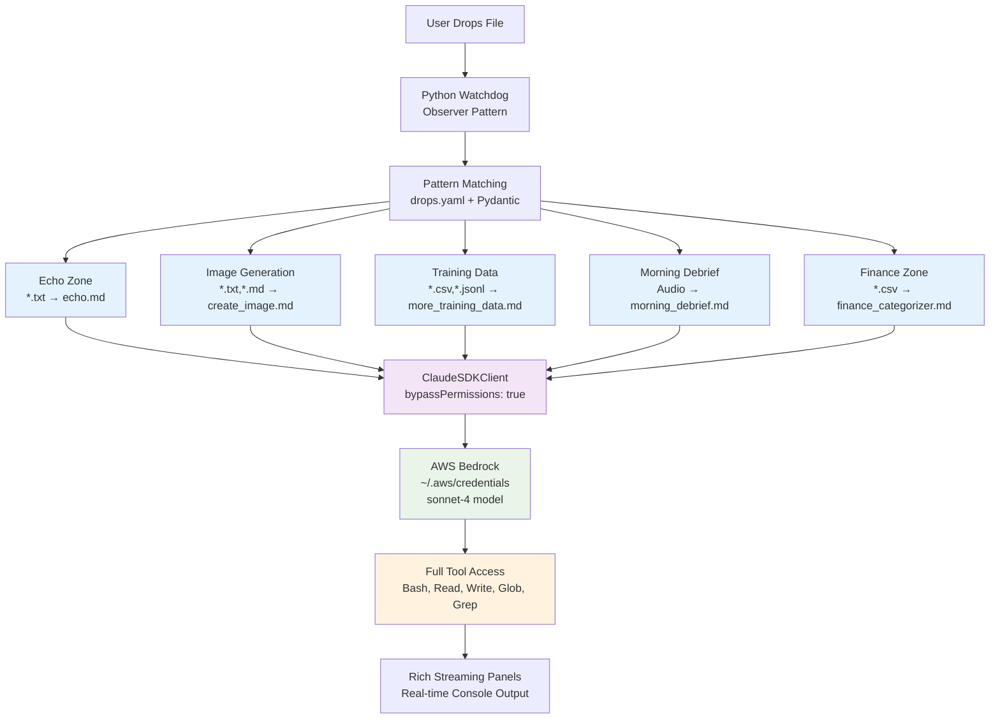
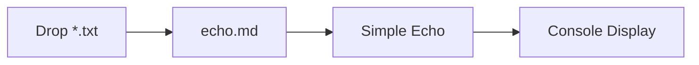
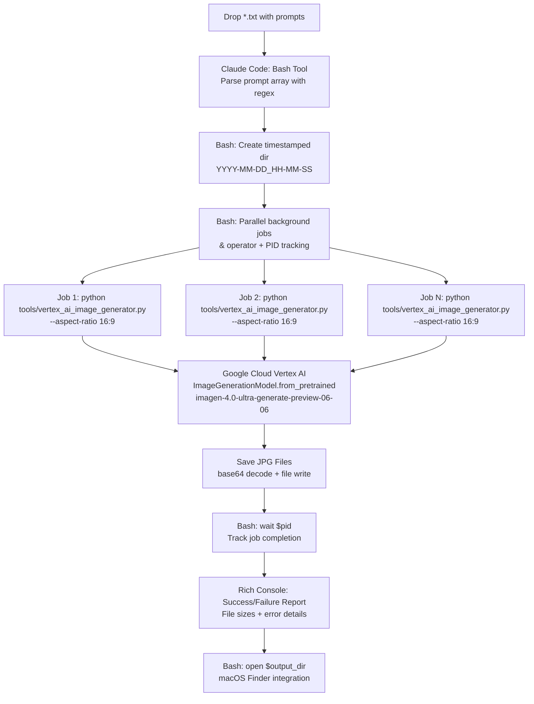
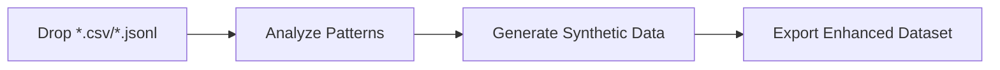
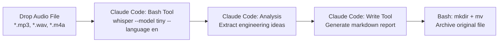
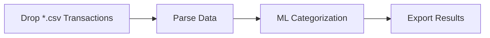
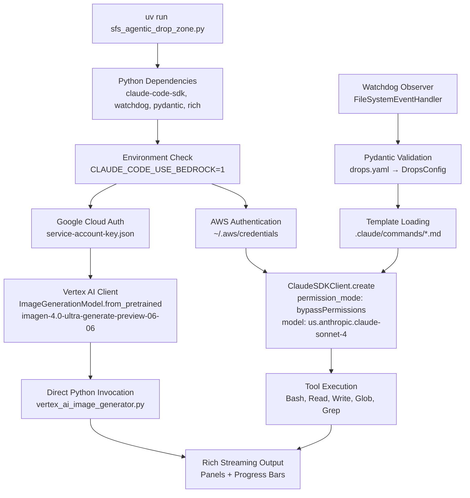

# Agentic Drop Zone System - Flow Diagram

## Main System Flow

## Use Case Specific Workflows

### 1. Echo Zone (Simple Test)

### 2. Image Generation (Parallel Processing)

### 3. Training Data Generation

### 4. Morning Debrief (Audio Processing)

### 5. Finance Categorization

## Technology Stack & Authentication Flow

## Technology Implementation Summary:

| Use Case | File Types | Technology Stack | Tool Invocations | Output |
|----------|------------|------------------|------------------|---------|
| **Echo** | `*.txt` | ClaudeSDKClient → AWS Bedrock | Simple prompt processing | Rich console display |
| **Image Generation** | `*.txt`, `*.md` | ClaudeSDKClient → Bash → Python subprocess | `python tools/vertex_ai_image_generator.py --aspect-ratio 16:9` | Parallel JPG files + completion report |
| **Training Data** | `*.csv`, `*.jsonl` | ClaudeSDKClient → Read/Write tools | Read CSV → Generate synthetic data → Write enhanced dataset | Enhanced dataset files |
| **Morning Debrief** | Audio files | ClaudeSDKClient → Bash → Whisper | `whisper --model tiny --language en` | Markdown transcription + analysis |
| **Finance** | `*.csv` | ClaudeSDKClient → Read/Write tools | Read CSV → ML categorization → Write results | Categorized transaction files |

## Key Technology Features:

- ✅ **File Monitoring**: Python Watchdog with Observer pattern
- ✅ **Configuration**: Pydantic validation of drops.yaml
- ✅ **Agent Execution**: ClaudeSDKClient with `bypassPermissions: true`
- ✅ **Authentication**: AWS Bedrock via `~/.aws/credentials`
- ✅ **Image Generation**: Direct Python invocation of `tools/vertex_ai_image_generator.py`
- ✅ **Parallel Processing**: Bash background jobs with PID tracking (`&` operator + `wait`)
- ✅ **Console Output**: Rich streaming panels with real-time progress
- ✅ **Tool Access**: Full suite (Bash, Read, Write, Glob, Grep)
- ✅ **Template System**: Variable substitution (`[[FILE_PATH]]` → actual path)
- ✅ **Error Handling**: Try/catch with detailed error reporting