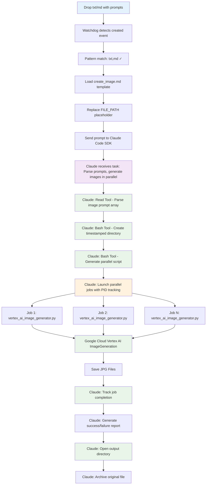
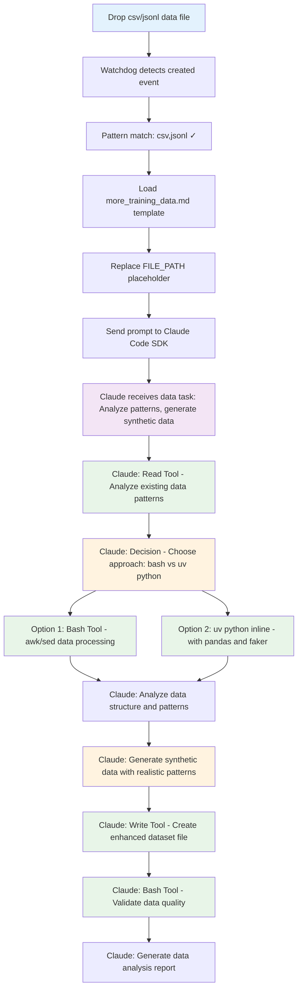
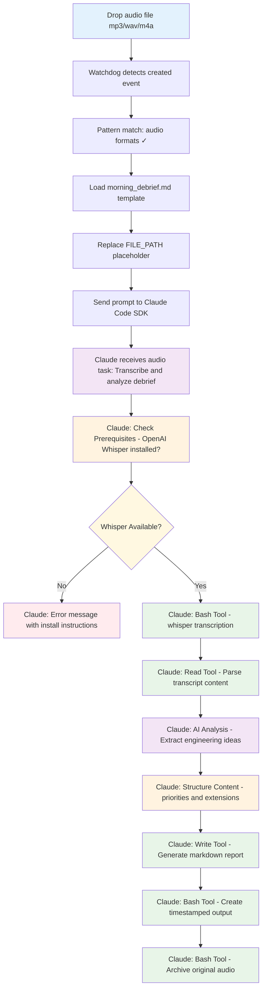
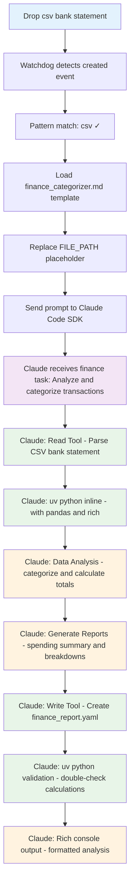

# System Architecture and Agent Integration

## Overview

This document explains the relationship between `sfs_agentic_drop_zone.py` and Claude Code, how agent selection works, and when Claude is involved in file processing.

## How Agent Selection Works

### File Processing Decision Flow

When a file is dropped, the system follows this decision process:

#### 1. **File System Detection** (Python Watchdog)
- Watchdog monitors specific directories (`zone_dirs` in `drops.yaml`)
- Detects file events: `created`, `modified`, `deleted`, `moved`
- Each drop zone can specify which events to respond to

#### 2. **File Pattern Matching** (`sfs_agentic_drop_zone.py:514`)
```python
if not any(path.match(pattern) for pattern in self.drop_zone.file_patterns):
    return  # Silent return - no processing
```
- Uses Python's `Path.match()` with glob patterns
- Example patterns: `["*.txt", "*.md"]`, `["*.csv"]`, `["*.mp3", "*.wav"]`
- **Only files matching patterns get processed**

#### 3. **Agent Selection** (Configured per drop zone)
Each drop zone in `drops.yaml` specifies:
```yaml
agent: "claude_code"        # or "gemini_cli" or "codex_cli"
model: "sonnet"             # Model to use
reusable_prompt: ".claude/commands/create_image.md"
```

## Available Agents

### **Claude Code SDK** (`agent: "claude_code"`)
**When used:**
- Default agent for all current drop zones
- Complex tasks requiring tool access (Bash, Read, Write, Glob, Grep)
- Tasks needing sophisticated reasoning

**How it works:**
- Uses Claude Code Python SDK with AWS Bedrock
- Runs in `bypassPermissions` mode (no prompts)
- Streams responses in real-time panels
- Has full tool access to your system

**Current zones using Claude:**
- Echo Zone (*.txt)
- Image Generation (*.txt, *.md)
- Training Data (*.csv, *.jsonl)
- Morning Debrief (audio files)
- Finance Categorization (*.csv)

### **Gemini CLI** (`agent: "gemini_cli"`)
**When used:**
- Alternative to Claude for specific use cases
- Quick tasks or when you want Google's models
- Currently **not used in any configured zones**

**How it works:**
- Subprocess execution of `gemini` command
- Uses `--yolo` flag (auto-approve tools)
- Uses `--sandbox` flag for safety
- Line-by-line streaming output

### **Codex CLI** (`agent: "codex_cli"`)
**When used:**
- Planned but **not yet implemented**
- Would be for OpenAI Codex integration

## When Claude is NOT Used

Claude is **not used** when:

1. **File doesn't match patterns**:
   - Drop `file.py` in image zone (only watches `*.txt`, `*.md`)
   - Drop `document.docx` anywhere (no zone watches `.docx`)

2. **Wrong directory**:
   - Drop `test.txt` in `/random/folder` (only watches configured `zone_dirs`)

3. **Wrong event type**:
   - Modify file in image zone (only watches `created` events)
   - Delete file in echo zone (watches `created`, `modified` only)

4. **Different agent configured**:
   - If you change `agent: "gemini_cli"` in drops.yaml
   - Gemini CLI subprocess runs instead of Claude

## Relationship Between `sfs_agentic_drop_zone.py` and Claude Code

### **They Are Two Separate Systems Working Together**

#### **`sfs_agentic_drop_zone.py`** = **Orchestrator/Controller**
- **Pure Python application** that monitors your file system
- **Uses Python Watchdog** to detect when files are dropped
- **Routes files to different agents** based on configuration
- **Controls the workflow** but doesn't do the AI processing itself

#### **Claude Code** = **AI Agent/Worker**
- **Separate AI system** that can use tools (Read, Write, Bash, etc.)
- **Receives prompts** and executes complex workflows autonomously
- **Has access to your system** through various tools
- **Does the actual "thinking" and task execution**

## Technical Integration Mechanism

### **1. Claude Code SDK Integration** (`claude-code-sdk`)
```python
# sfs_agentic_drop_zone.py imports the SDK
from claude_code_sdk import ClaudeSDKClient, ClaudeCodeOptions

# Creates a client to communicate with Claude Code
async with ClaudeSDKClient(options=options) as client:
    await client.query(full_prompt)  # Send the prompt

    # Receive streaming responses
    async for message in client.receive_response():
        # Display Claude's responses in real-time
```

### **2. Key Configuration**
```python
options_dict = {
    "permission_mode": "bypassPermissions"  # No prompts - full autonomy
}
if args.model:
    options_dict["model"] = args.model  # "sonnet", "opus", etc.
```

## Complete Execution Flow

```
┌─────────────────────────┐    ┌─────────────────────────┐
│   sfs_agentic_drop_     │    │      Claude Code        │
│   zone.py               │    │      (AI Agent)         │
└─────────────────────────┘    └─────────────────────────┘
           │                              │
    1. File dropped                       │
           │                              │
    2. Watchdog detects                   │
           │                              │
    3. Pattern match                      │
           │                              │
    4. Load prompt template               │
           │                              │
    5. Replace [[FILE_PATH]]              │
           │                              │
    6. ────────── Send Prompt ──────────▶ │
           │                              │
           │                       7. Receive prompt
           │                              │
           │                       8. Understand task
           │                              │
           │                       9. Use tools:
           │                          • Read files
           │                          • Run bash commands
           │                          • Write files
           │                              │
    10. ◀────── Stream Responses ──────── │
           │                              │
    11. Display in panels                 │
           │                              │
    12. Workflow complete                 │
```

## Division of Responsibilities

### **`sfs_agentic_drop_zone.py` Responsibilities:**
- ✅ **File system monitoring** (Python Watchdog)
- ✅ **Configuration management** (drops.yaml parsing)
- ✅ **Pattern matching** (*.txt, *.csv, etc.)
- ✅ **Agent routing** (Claude vs Gemini vs Codex)
- ✅ **Prompt template loading** (.claude/commands/*.md)
- ✅ **Variable substitution** ([[FILE_PATH]] replacement)
- ✅ **Response display** (Rich panels and streaming)
- ❌ **NO AI processing** - just orchestration

### **Claude Code Responsibilities:**
- ✅ **AI reasoning** and task interpretation
- ✅ **Tool execution** (Bash, Read, Write, Glob, Grep)
- ✅ **Workflow execution** (following multi-step instructions)
- ✅ **Error handling** (adapting when things go wrong)
- ✅ **Decision making** (choosing which tools to use)
- ❌ **NO file monitoring** - just task execution

## Claude Code's Role in Echo Zone Example

### When You Drop a *.txt File in `agentic_drop_zone/echo_zone/`

#### 1. **File Detection & Agent Selection**
```yaml
file_patterns: ["*.txt"]        # Only .txt files trigger
agent: "claude_code"           # Claude Code SDK is chosen
model: "sonnet"                # Uses Claude Sonnet model
```

#### 2. **Prompt Construction**
The system:
- Loads `.claude/commands/echo.md` (the prompt template)
- Replaces `[[FILE_PATH]]` with actual dropped file path
- Creates final prompt that Claude receives:

```
# Echo Command

Echo the contents of the file at /path/to/your/file.txt and provide a brief summary.

## Variables

DROPPED_FILE_PATH: /path/to/your/file.txt
DROPPED_FILE_PATH_ARCHIVE: agentic_drop_zone/echo_zone/drop_zone_file_archive/

## Workflow
1. Read the file contents at DROPPED_FILE_PATH
2. Write out the file in between a markdown code block
3. Below log the total number of characters in the file and the file name
4. Move the file to the archive: `mv DROPPED_FILE_PATH DROPPED_FILE_PATH_ARCHIVE/`
```

#### 3. **Claude Code Execution**
Claude Code acts as an **autonomous agent** that:

**Uses Tools to Execute Instructions:**
- **Read Tool**: Reads the dropped file contents
- **Bash Tool**: Runs shell commands (like `mv` to archive the file)
- **Write Tool**: Could create output files if needed

**Follows the Workflow:**
1. Reads your file using the Read tool
2. Displays contents in markdown code block
3. Counts characters and shows file name
4. Archives the file using `mv` command via Bash tool

#### 4. **Key Point: Claude Code = Intelligent Tool User**

Claude Code is **NOT** just echoing text. It's:
- **Interpreting instructions** from the prompt template
- **Making decisions** about how to execute the workflow
- **Using tools autonomously** (Read, Bash, Write, etc.)
- **Handling errors** if files don't exist or commands fail

## System Architecture Benefits

### **Key Insight: Division of Labor**

**`sfs_agentic_drop_zone.py`** is like a **smart dispatcher**:
- "Hey Claude, someone dropped a .txt file in the echo zone"
- "Here's the prompt template with the file path filled in"
- "Please handle this workflow"

**Claude Code** is like an **intelligent worker**:
- "I understand - I need to read this file, format it, and archive it"
- "Let me use the Read tool to get the contents"
- "Now I'll use Bash to move it to the archive folder"
- "Here's the formatted output for the user"

### **Why This Architecture?**

1. **Separation of Concerns**: File monitoring vs AI processing
2. **Scalability**: Can add new file patterns without changing Claude
3. **Flexibility**: Can switch between different AI agents
4. **Reliability**: Watchdog handles file detection, Claude handles complex tasks
5. **Modularity**: Each system does what it's best at

The genius is that **file drops become AI workflows** - your file system becomes an interface to trigger intelligent automation!

## Current Configuration Summary

**All 5 drop zones currently use Claude Code:**
```yaml
- Echo: claude_code + sonnet (*.txt files)
- Image Gen: claude_code + sonnet (*.txt, *.md files)
- Training: claude_code + sonnet (*.csv, *.jsonl files)
- Morning Debrief: claude_code + sonnet (audio files)
- Finance: claude_code + sonnet (*.csv files)
```

**To use a different agent**, modify `drops.yaml`:
```yaml
agent: "gemini_cli"  # Instead of "claude_code"
model: "gemini-2.5-pro"  # Instead of "sonnet"
```

The system is **highly configurable** - you can easily change which agent processes which file types by editing the drop zone configurations!

## Detailed Flow Diagrams for Each Use Case

### 1. Echo Zone (Simple Test Workflow)

**Trigger**: Drop `*.txt` file in `agentic_drop_zone/echo_zone/`

```mermaid
graph TD
    A[Drop *.txt file] --> B[Watchdog detects created/modified event]
    B --> C[Pattern match: *.txt ✓]
    C --> D[Load echo.md template]
    D --> E[Replace [[FILE_PATH]] with actual path]
    E --> F[Send prompt to Claude Code SDK]

    F --> G[Claude receives task:<br/>Read file, format output, archive]
    G --> H[Claude: Read Tool<br/>Get file contents]
    H --> I[Claude: Display content in markdown block]
    I --> J[Claude: Count characters and show filename]
    J --> K[Claude: Bash Tool<br/>mv file to archive/]
    K --> L[Stream results to Rich console panels]

    style A fill:#e3f2fd
    style G fill:#f3e5f5
    style H fill:#e8f5e8
    style J fill:#e8f5e8
    style K fill:#e8f5e8
```

**Claude's Tools Used**: Read, Bash
**Output**: File contents display + archive to `drop_zone_file_archive/`

---

### 2. Image Generation (Parallel Processing Workflow)

**Trigger**: Drop `*.txt` or `*.md` file with image prompts in `agentic_drop_zone/generate_images_zone/`



**Claude's Tools Used**: Read, Bash (complex orchestration)
**External Tools**: `tools/vertex_ai_image_generator.py`
**Output**: Multiple JPG images + completion report + directory opening

---

### 3. Training Data Generation (Data Analysis Workflow)

**Trigger**: Drop `*.csv` or `*.jsonl` file in `agentic_drop_zone/training_data_zone/`



**Claude's Tools Used**: Read, Write, Bash (+ optional uv python inline)
**Output**: Enhanced dataset + analysis report

---

### 4. Morning Debrief (Audio Processing Workflow)

**Trigger**: Drop audio file (`*.mp3`, `*.wav`, `*.m4a`, etc.) in `agentic_drop_zone/morning_debrief_zone/`



**Claude's Tools Used**: Bash (Whisper), Read, Write
**External Dependencies**: `openai-whisper` (uv tool)
**Output**: Structured markdown analysis + transcript + audio archive

---

### 5. Finance Categorization (Financial Analysis Workflow)

**Trigger**: Drop `*.csv` bank statement in `agentic_drop_zone/finance_zone/`



**Claude's Tools Used**: Read, Write, Bash (uv python with pandas/rich)
**Output**: YAML financial report + rich console analysis

---

## Common Patterns Across All Workflows

### **Standard Flow Elements**
1. **File Detection**: Watchdog + pattern matching
2. **Template Loading**: Load `.claude/commands/*.md`
3. **Variable Substitution**: Replace `[[FILE_PATH]]`
4. **Claude Execution**: SDK client with `bypassPermissions`
5. **Tool Orchestration**: Claude uses appropriate tools
6. **Rich Output**: Streaming panels with zone colors

### **Claude's Consistent Behaviors**
- **Error Handling**: Adapts when files missing or tools fail
- **Tool Selection**: Chooses optimal tools for each task
- **Workflow Execution**: Follows multi-step instructions reliably
- **Output Formatting**: Creates user-friendly results
- **File Management**: Archives originals, creates organized outputs

### **Architecture Benefits Demonstrated**
- **Specialization**: Each zone handles specific file types and workflows
- **Consistency**: All zones use same underlying orchestration
- **Flexibility**: Easy to modify agents, models, or workflows
- **Scalability**: Adding new zones is straightforward
- **Intelligence**: Claude adapts workflows to handle edge cases